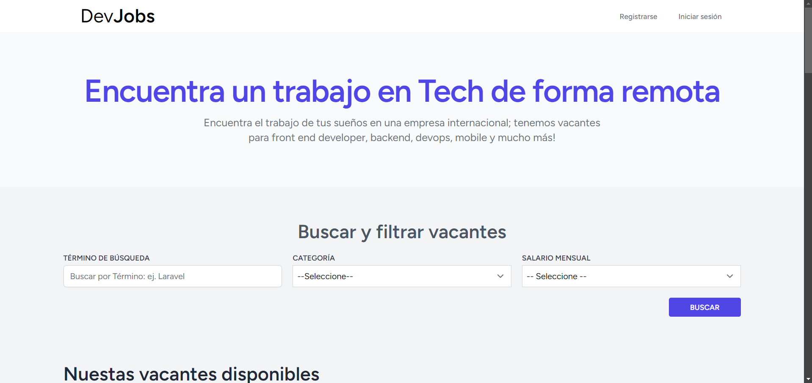
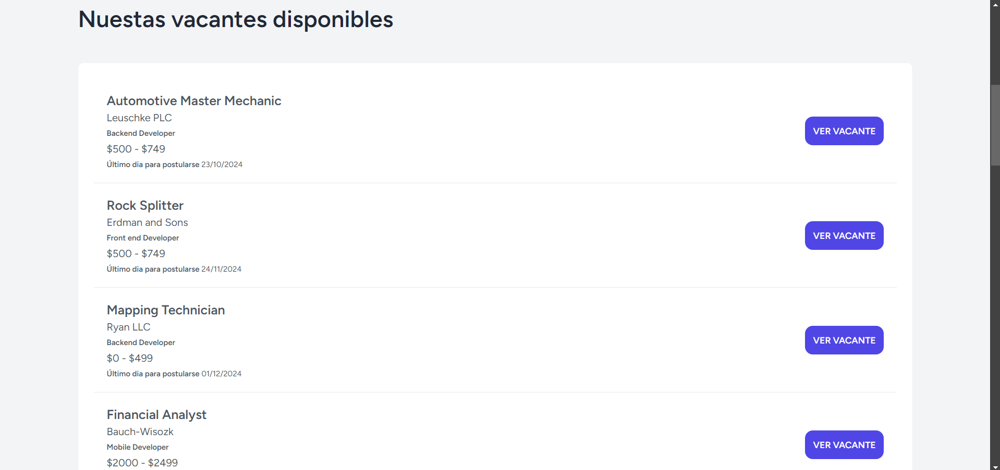
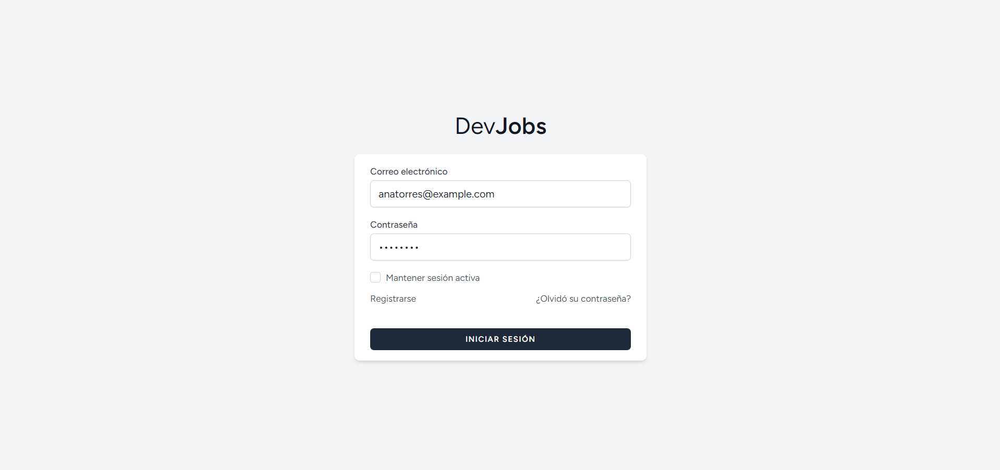
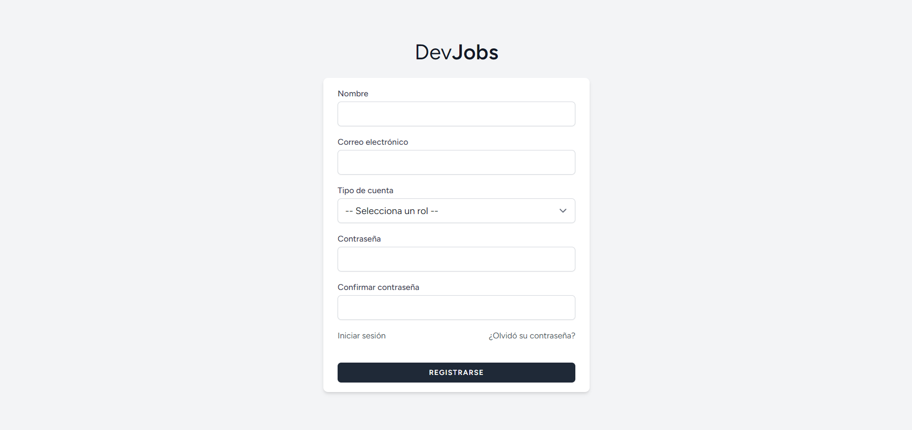
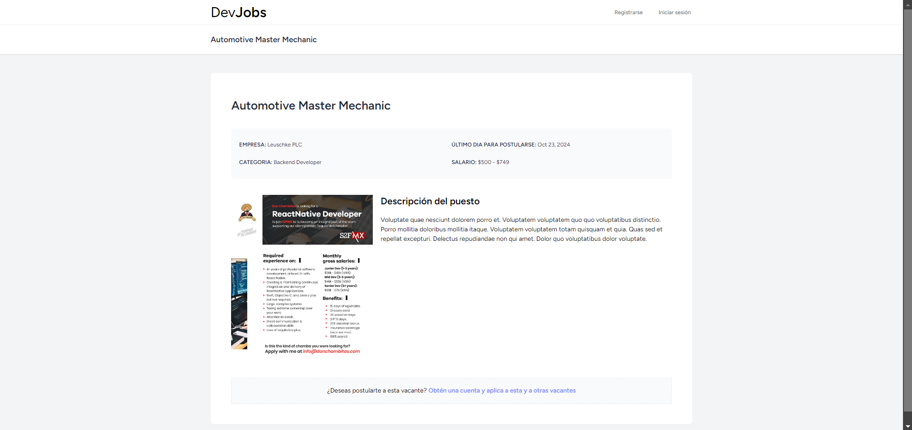
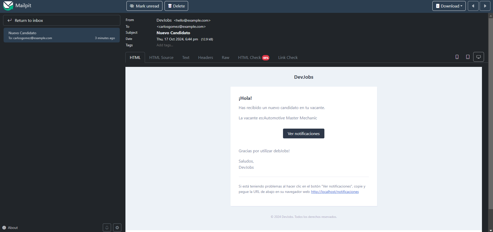
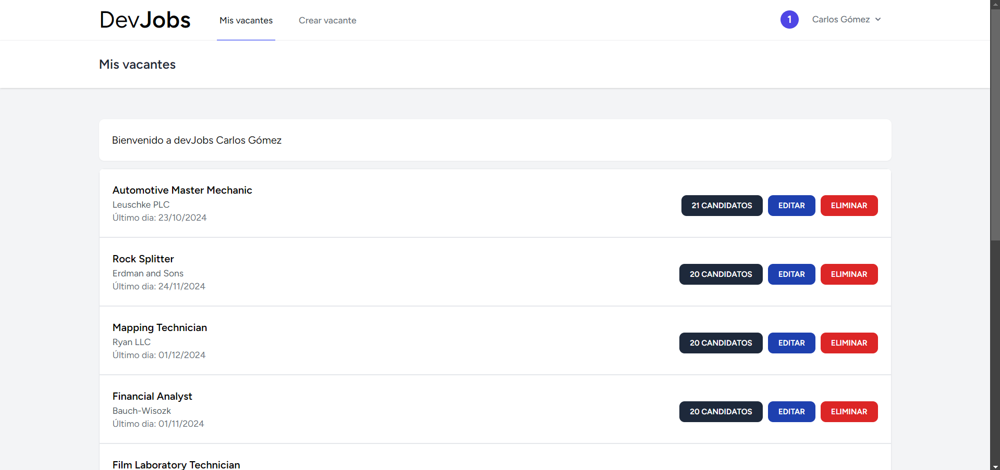
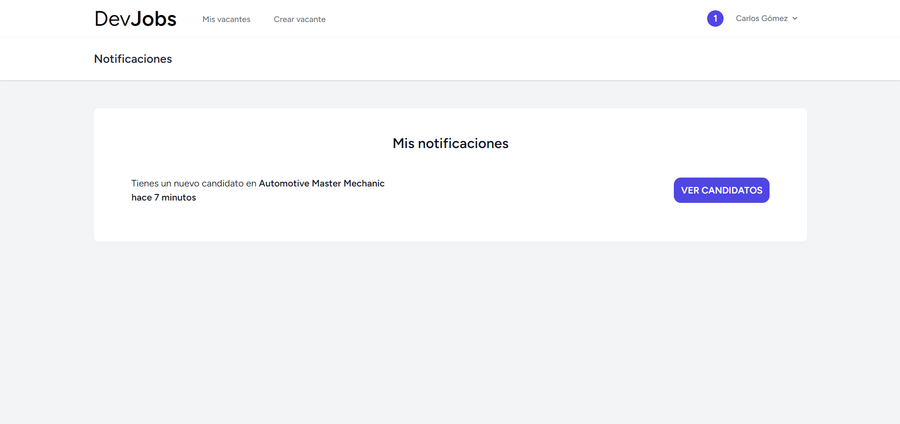
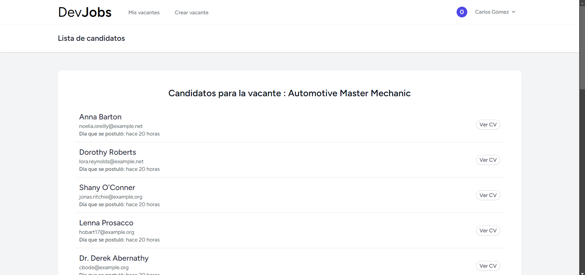
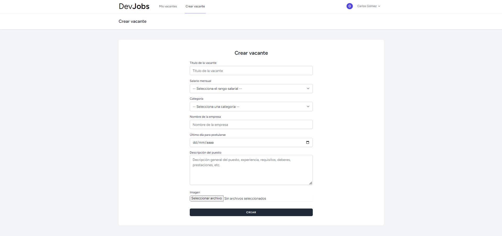

# DevJobs

DevJobs es una plataforma para la búsqueda y publicación de ofertas de empleo, dirigida tanto a desarrolladores como a reclutadores. Los reclutadores pueden publicar vacantes, y los desarrolladores pueden postularse a esas vacantes enviando su currículum vitae.

## Descripción del proyecto

DevJobs está diseñado para facilitar el proceso de reclutamiento en el sector tecnológico. La plataforma permite a los reclutadores gestionar las vacantes de empleo y recibir aplicaciones de candidatos, mientras que los desarrolladores pueden explorar oportunidades laborales en función de sus intereses y habilidades.

## Características

- Registro y autenticación de usuarios.
- Publicación de vacantes.
- Gestión de candidatos.
- Postulación a vacantes.
- Panel de administración.
- Interfaz amigable y responsive.

## Tecnologías utilizadas

+ **Lenguajes:** PHP, HTML, CSS y JavaScript
+ **Base de datos:** MySQL
+ **Frameworks:** Laravel, Tailwind CSS y Livewire.
+ **Autenticación:** Laravel Breeze
+ **Herramientas de desarrollo:** Docker, Visual Studio Code

## Instalación y configuración

Para ejecutar este proyecto en tu entorno local, sigue estos pasos:

1. Clona el repositorio:
```bash
git clone https://github.com/urieltorres-dev/devjobs.git
```

2. Instala las dependencias de Composer:
```bash
composer install
```

3. Instala las dependencias de Node.js:
```bash
npm install
```

4. Configura el archivo `.env` y genera la clave de la aplicación:
```bash
cp .env.example .env
php artisan key:generate
```

5. Ejecuta las migraciones y seeders:
```bash
php artisan migrate --seed
```

6. Inicia el servidor de desarrollo:
```bash
php artisan serve
```

7. Ejecuta los assets de frontend:
```bash
npm run dev
```

8. Accede a la aplicación a través de tu navegador en `http://localhost:8000`.

## Roles de Usuario

+ **Desarrollador:** Puede buscar vacantes, postularse y subir su CV.
+ **Reclutador:** Puede crear, editar y eliminar vacantes, así como gestionar los candidatos que aplican.

## Capturas de pantalla

A continuación se muestran algunas capturas de pantalla de la aplicación:

## Capturas de pantalla

<table>
  <tr>
    <td align="center">
      
      <br><b>Página principal 1</b>
    </td>
    <td align="center">
      
      <br><b>Página principal 2</b>
    </td>
  </tr>
  <tr>
    <td align="center">
      
      <br><b>Login</b>
    </td>
    <td align="center">
      
      <br><b>Register</b>
    </td>
  </tr>
  <tr>
    <td align="center">
      
      <br><b>Vacante</b>
    </td>
    <td align="center">
      
      <br><b>Correo electrónico de notificación</b>
    </td>
  </tr>
  <tr>
    <td align="center">
      
      <br><b>Dashboard</b>
    </td>
    <td align="center">
      
      <br><b>Notificaciones</b>
    </td>
  </tr>
  <tr>
    <td align="center">
      
      <br><b>Candidatos</b>
    </td>
    <td align="center">
      
      <br><b>Formulario para crear vacantes</b>
    </td>
  </tr>
</table>


## Demo

Por el momento la demo no está  disponible.

## Licencia

Este proyecto está licenciado bajo la Licencia MIT - consulta el archivo [LICENSE](https://choosealicense.com/licenses/mit/) para más detalles.

## Contacto

Para más información o consultas, puedes contactarme a través de [urieltorres.dev@gmail.com](mailto:urieltorres.dev@gmail.com) o en [github.com/urieltorres-dev](https://github.com/urieltorres-dev).

